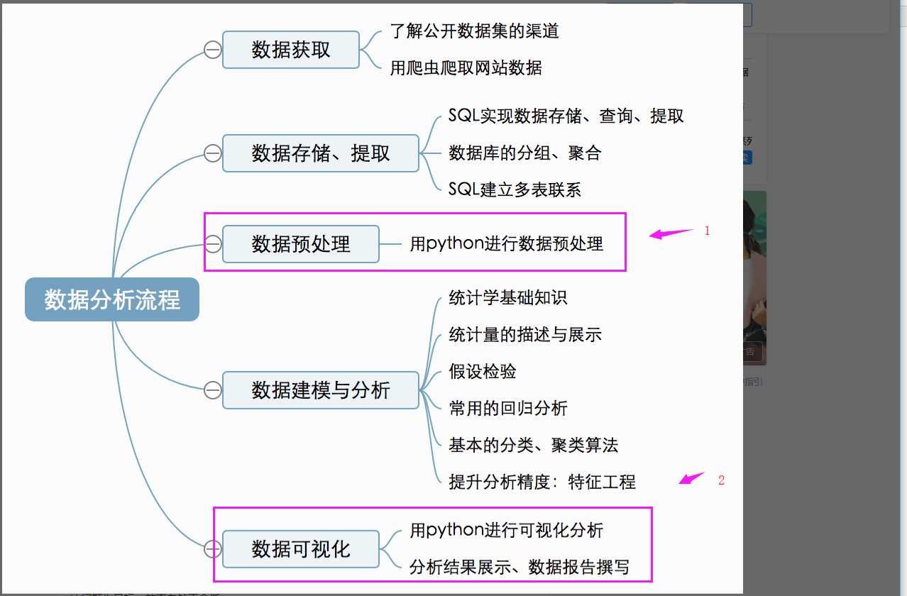

# 纲领

先从对数据预处理，数据可视化开始，这两方面比较简单，当你会用数据的时候，收集数据时就知道要那些数据，该存那些数据。  

# 第一阶段

# 一：学习python
    基本语法
# 二：python代码规范（2019.5.6-2019-5.7）

直接百度上述关键词即可  
看过的一些资料（比较基础）：  
https://zh-google-styleguide.readthedocs.io/en/latest/google-python-styleguide/python_style_rules/  

https://www.jianshu.com/p/8b6c425b65a6

# 三：简单的Git学习（2019.5.7- ...）
用来托管你的代码。  
也只有自己百度，我直接看的思维导图学习（下面github链接里有），有问题问就是了，我不可能全部都给你安排了  

# 四：分一点精力去弄 大数据比赛。
